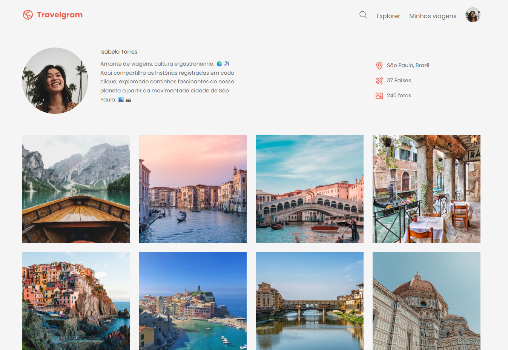

# Travelgram

Uma página de perfil de viagens responsiva desenvolvida com **HTML5** e **CSS3**. O projeto foi desenvolvido com base em um layout disponibilizado pela **Rocketseat** no Figma Community.

## Tecnologias

- HTML5
- CSS3

## Funcionalidades

- Layout moderno e responsivo
- Estrutura semântica em HTML
- Organização do CSS em arquivos separados
- Galeria de fotos em grid flexível
- Imagens responsivas
- Menu adaptado para telas menores

## O que aprendi

Durante o desenvolvimento deste projeto pratiquei:

- Estruturação semântica com elementos como `nav`, `header`, `main` e `footer`
- Organização do CSS utilizando múltiplos arquivos com `@import`
- Uso de variáveis CSS (`:root`) para cores e tipografia
- Alinhamento e espaçamento com **Flexbox**
- Responsividade utilizando **Media Queries** (mobile e tablet)
- Imagens fluidas com `aspect-ratio` e `object-fit`
- Boas práticas na organização de projetos front-end

## Layout

O design utilizado neste projeto está disponível no Figma:

🔗 <https://www.figma.com/community/file/1360315496868719817/perfil-de-viagens>

## Como executar

- Abra o arquivo `index.html` no navegador.
